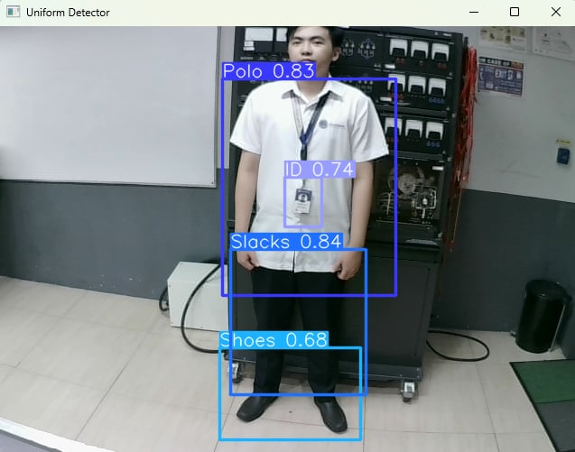

# Complete Uniform Detection System using YOLOv3

   

A **YOLOv3-based system** for automated uniform compliance verification, integrated with a miniature Arduino-controlled gate for real-time access control.

---

## 🚀 Overview

This project implements a **uniform detection system** that identifies required attire components:

- White polo shirt  
- Slacks  
- ID badge  
- Black shoes  

The system is trained using **YOLOv3** in **Google Colab**. Upon successful verification of a complete uniform, a **miniature gate powered by Arduino Uno** automatically opens, demonstrating end-to-end automation.

---

## ⚙️ Features

- **Real-time detection:** Fast, accurate identification of uniform components.  
- **Hardware integration:** Arduino Uno-controlled gate responds automatically.  
- **Modular design:** Easily add new uniform items or rules.  
- **Cloud-friendly training:** YOLOv3 training in Google Colab for easy setup.

---

## 🏗️ System Architecture

Camera Feed → YOLOv3 Detection → Uniform Verification → Arduino Signal → Gate Activation

- Camera feed captures the person entering.
- YOLOv3 model detects and classifies uniform components.
- Uniform verification module checks if all required items are present.
- Arduino Uno receives a signal to open the gate if the uniform is complete.

